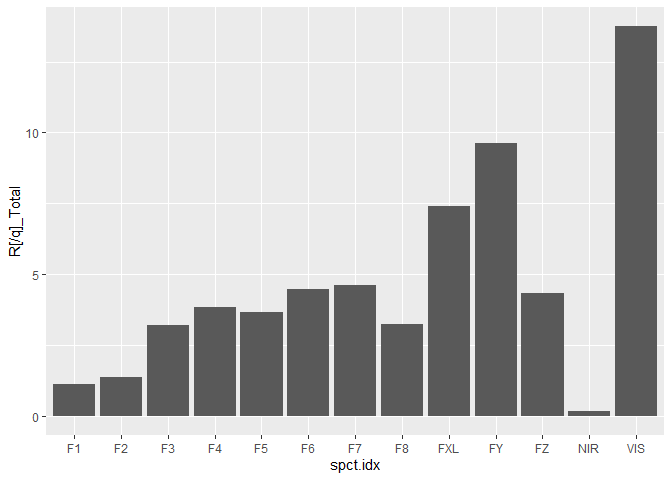

<!-- README.md is generated from README.Rmd. Please edit that file -->

# AS7343

<!-- badges: start -->

<!-- badges: end -->

The goal of AS7343 is to simulate the response of the AS7343 spectral
sensor from asm OSRAM. Based on a light spectrum with high wavelength
resolution simulate the response of each of the 13 channels of the
AS7343 digital spectral sensor, or any other sensor. With the
simulations of channels responses further analysis will attempt to
retrieve quantities of interest such as PAR, ePAR, UVA:PAR, R:FR and B:G
ratios.

## Installation

You can install the development version of AS7343 with:

``` r
remotes::install_github("aphalo/AS7343")
packageVersion("AS7343")
```

## Example

This is a basic example which shows you how to solve a common problem:

``` r
library(AS7343)
#> Loading required package: photobiology
#> Loading required package: SunCalcMeeus
#> Documentation at https://docs.r4photobiology.info/
#> Loading required package: photobiologySensors
library(ggspectra)
#> Loading required package: ggplot2
simul_response(sun.spct, ams_AS7343.spct, 
               unit.out = "photon",
               scale.factor = 1e-6) |>
  ggplot(aes(spct.idx, .data[["R[/q]_Total"]])) +
  geom_col()
```


